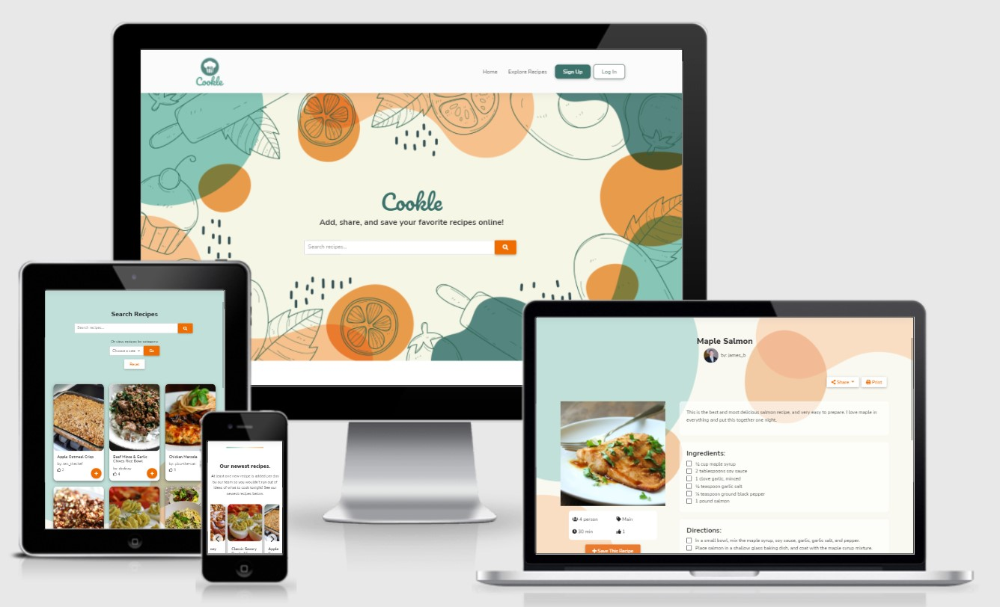
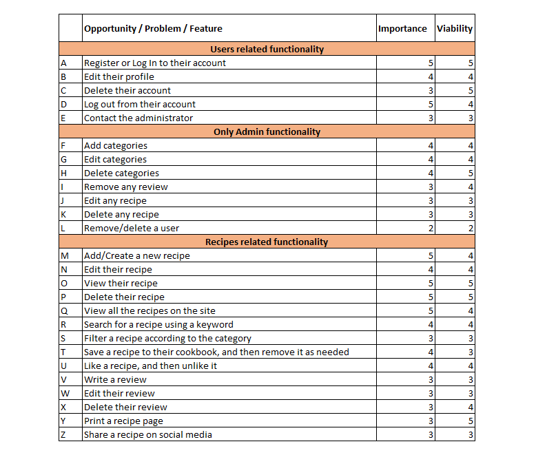
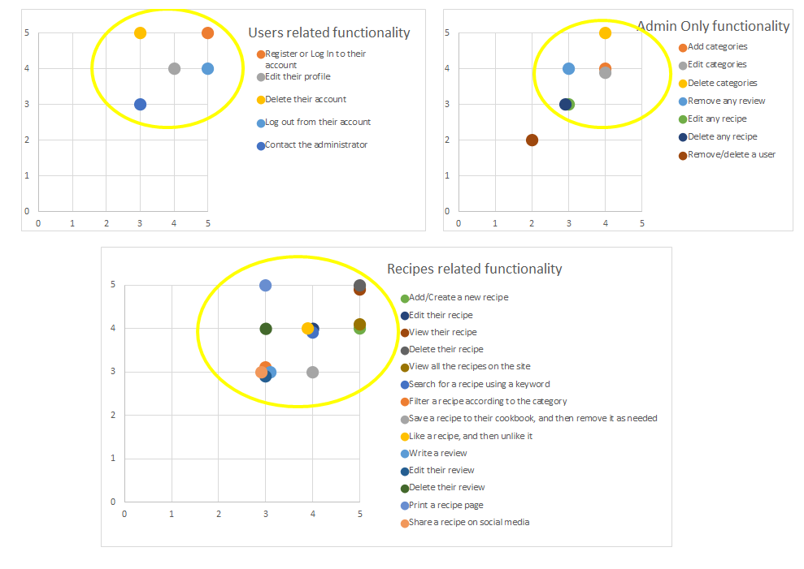
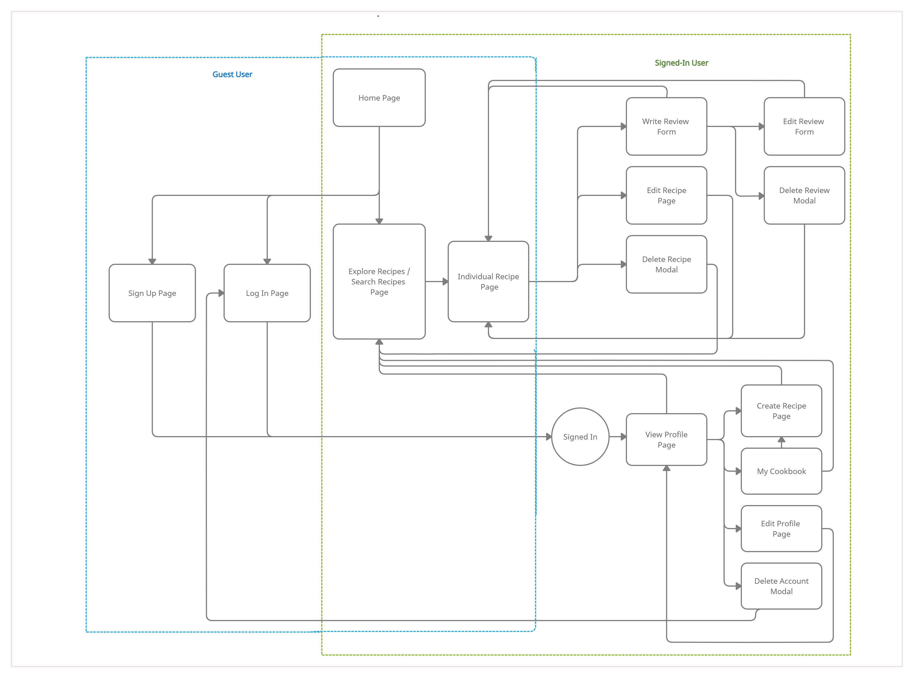
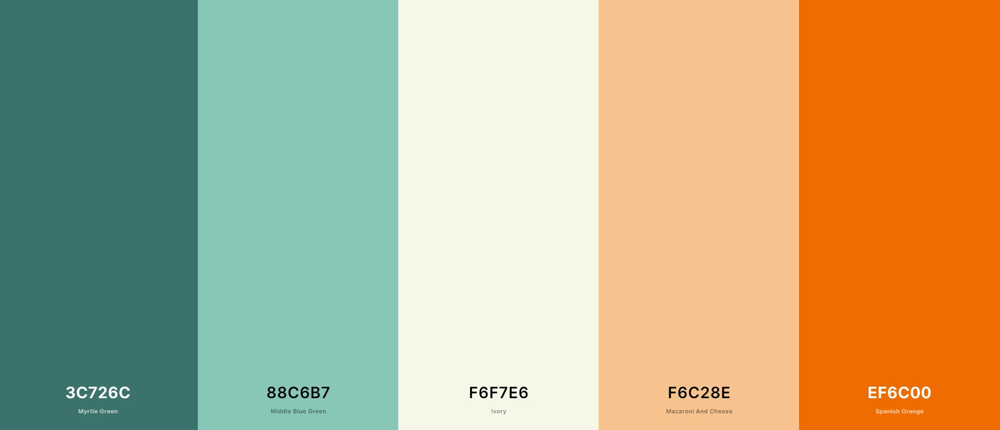
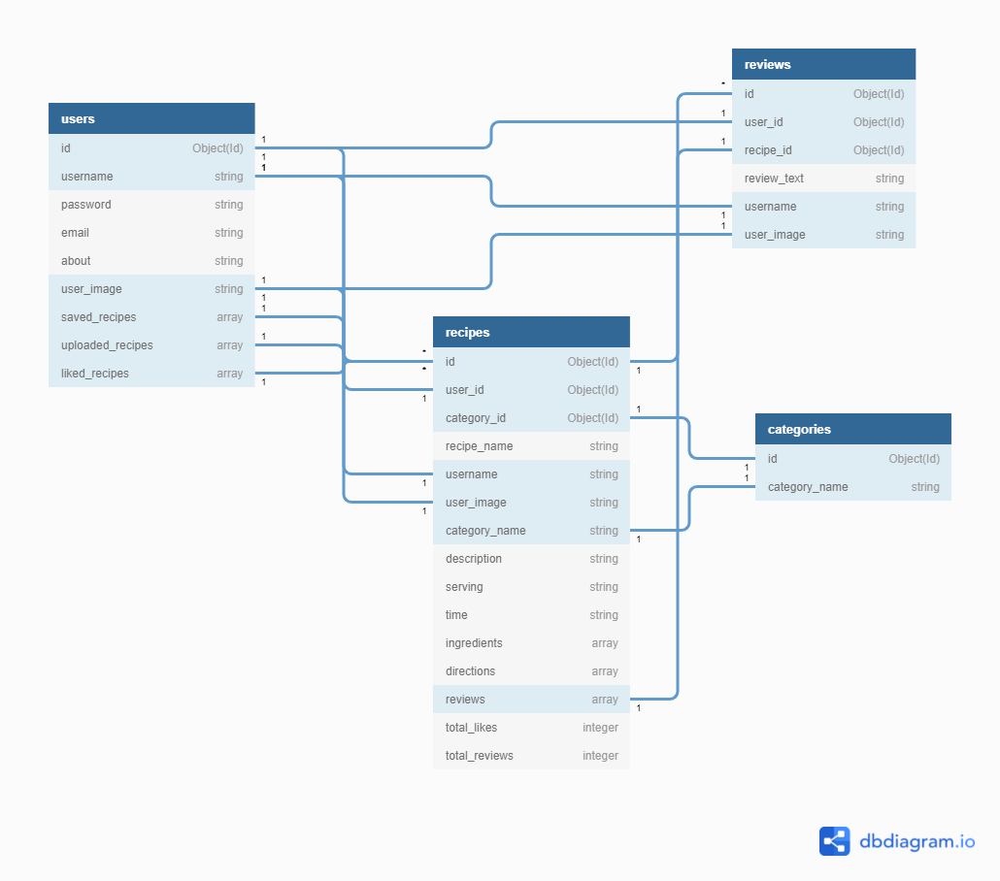

# **Cookle**

  

Cookle is a recipe-sharing web application that allows users to easily create and save their recipes online, as well as search for recipes and conveniently save them to the cookbook. Inspired by online recipe sharing platforms such as Allrecipes and Cookpad, Cookie was designed as a modern and fun web application with a great UI/UX in mind, and provides the functionalities a recipe-sharing website should have.  
 
Please note that this web application was created for the Code Institute’s Milestone Project 3 as part of their Diploma in Full Stack Software Development. The requirements are to build a web application using HTML, CSS, JavaScript, Python+Flask, MongoDB, and other additional libraries as needed. The site should allow the user to perform basic CRUD functionality (Create, Read, Update, and Delete), thus making use of this site and engaging with the community.   

[View live website here](https://cookle-cookbook.herokuapp.com/)

<br/>   

# **Table of Contents**   
1. [UX Development Planes](https://github.com/dissyulina/cookle-cookbook#1-ux-development-plane)   
   A. [Strategy Plane](https://github.com/dissyulina/cookle-cookbook#a-strategy-plane)  
   &nbsp;&nbsp;&nbsp;&nbsp;&nbsp;&nbsp;&nbsp;- [User Stories](https://github.com/dissyulina/cookle-cookbook#online-research)  
   &nbsp;&nbsp;&nbsp;&nbsp;&nbsp;&nbsp;&nbsp;- [Online Research](https://github.com/dissyulina/cookle-cookbook#online-research)  
   &nbsp;&nbsp;&nbsp;&nbsp;&nbsp;&nbsp;&nbsp;- [Project Goals, User Goals, and Developer Goals](https://github.com/dissyulina/cookle-cookbook#project-goals)  
   &nbsp;&nbsp;&nbsp;&nbsp;&nbsp;&nbsp;&nbsp;- [Strategy Table](https://github.com/dissyulina/cookle-cookbook#strategy-table)  
   B. [Scope Plane](https://github.com/dissyulina/cookle-cookbook#b-scope-plane)  
   C. [Structure Plane](https://github.com/dissyulina/cookle-cookbook#c-structure-plane)  
   D. [Skeleton Plane](https://github.com/dissyulina/cookle-cookbook#d-skeleton-plane)  
   E. [Surface Plane](https://github.com/dissyulina/cookle-cookbook#e-surface-plane)  
   &nbsp;&nbsp;&nbsp;&nbsp;&nbsp;&nbsp;&nbsp;- [Color Scheme](https://github.com/dissyulina/cookle-cookbook#color-scheme)  
   &nbsp;&nbsp;&nbsp;&nbsp;&nbsp;&nbsp;&nbsp;- [Typography](https://github.com/dissyulina/cookle-cookbook#typography)  
   &nbsp;&nbsp;&nbsp;&nbsp;&nbsp;&nbsp;&nbsp;- [Imagery](https://github.com/dissyulina/cookle-cookbook#imagery)  
   &nbsp;&nbsp;&nbsp;&nbsp;&nbsp;&nbsp;&nbsp;- [Database Structure](https://github.com/dissyulina/cookle-cookbook#database-structure)  

2. [Features](https://github.com/dissyulina/cookle-cookbook#2-features)  
   &nbsp;&nbsp;- [Existing Features](https://github.com/dissyulina/cookle-cookbook#existing-features)   
   &nbsp;&nbsp;&nbsp;&nbsp;&nbsp;&nbsp;a. [General Design Features](https://github.com/dissyulina/cookle-cookbook#a-general-design-features)  
   &nbsp;&nbsp;&nbsp;&nbsp;&nbsp;&nbsp;b. [Page Design Features](https://github.com/dissyulina/cookle-cookbook#b-page-design-features)   
   &nbsp;&nbsp;- [Features to be Implemented in The Future](https://github.com/dissyulina/cookle-cookbook#features-to-be-implemented-in-the-future)

3. [Issues and Bugs](https://github.com/dissyulina/cookle-cookbook#3-issues-and-bugs)  
   &nbsp;&nbsp;- [Solved Issues](https://github.com/dissyulina/cookle-cookbook#solved-issues)  
   &nbsp;&nbsp;- [Known Issues & Unsolved Bugs](https://github.com/dissyulina/cookle-cookbook#known-issues--unsolved-bugs)  
   
4. [Testing](https://github.com/dissyulina/cookle-cookbook#4-testing)   
   &nbsp;&nbsp;- [Go to TESTING.md](https://github.com/dissyulina/cookle-cookbook/blob/main/TESTING.md#cookle---testing) 

5. [Technology Used](https://github.com/dissyulina/cookle-cookbook#5-technology-used)  
   &nbsp;&nbsp;- [Main Languanges](https://github.com/dissyulina/cookle-cookbook#main-languages-used)  
   &nbsp;&nbsp;- [Libraries and Frameworks](https://github.com/dissyulina/cookle-cookbook#libraries-and-frameworks)  
   &nbsp;&nbsp;- [Database Management](https://github.com/dissyulina/cookle-cookbook#database-management)  
   &nbsp;&nbsp;- [Tools and Programs](https://github.com/dissyulina/cookle-cookbook#tools-and-programs)  

6. [Deployment](https://github.com/dissyulina/cookle-cookbook#6-deployment)  
   &nbsp;&nbsp;- [Deployment to Heroku](https://github.com/dissyulina/cookle-cookbook#deployment-to-heroku)  
   &nbsp;&nbsp;- [How To Use This Project](https://github.com/dissyulina/cookle-cookbook#how-to-use-this-project)  

7. [Credits](https://github.com/dissyulina/cookle-cookbook#7-credits)  
   &nbsp;&nbsp;- [Code](https://github.com/dissyulina/cookle-cookbook#code)  
   &nbsp;&nbsp;- [Contents](https://github.com/dissyulina/cookle-cookbook#contents)    
   &nbsp;&nbsp;- [Images](https://github.com/dissyulina/cookle-cookbook#images-and-icons)  
 
8. [Acknowledgements](https://github.com/dissyulina/cookle-cookbook#8-acknowledgements)  

<br/>   

# **1. UX Development Plane**   

## **A. Strategy Plane**    
### **User Stories**   
As a new/ unregistered user, I want to:  
1. Be able to search for a recipe easily.  
2. See the popular recipes of the site.  
3. Explore all recipes listed in the site.  
4. Be able to view a full recipe that I'm interested in.  
5. Navigate intuitively and can spot the Sign-Up button right away.  
6. Understand what the site is about and how it works.  

As a returning/ registered user, I want to:
1. Immediately be able to spot the Log In button.  
2. See the newest added recipes on the site.  
3. Once logged in, easily navigate to my account settings, my cookbook, and other pages available to me.  
4. Be able to edit or delete my profile.  
5. Be able to create a recipe and share it to the site, and to Edit or Delete it afterward as needed.  
6. Be able to save a recipe that I like to my cookbook, and remove it from my cookbook as needed.  
7. Be able to give a like to a recipe, and also unlike it as needed.  
8. Be able to write a review on a recipe page, and to edit or delete my review.  
9. Be able to share a recipe on social media easily.  
10. Be able to print a recipe easily.  
11. Find a contact page for my inquiries.  

As an Administrative Account holder, I want to:
1. Be able to do all the functionalities as a registered user can.   
2. Add, Edit, or Delete a category of recipes.  
3. Be able to edit any recipes listed on the site as needed.  
4. Be able to delete any recipes listed on the site as needed.  
5. Be able to delete offensive reviews on the site as needed.  
 

### **Online Research**   
As a part of the planning process, online research was done to gain some inspiration on UI and UX of a recipe sharing website, including:
1. [Allrecipes](https://www.allrecipes.com/)   
2. [Cookpad](https://cookpad.com/uk?via=jp)   
3. Similar recipe sharing site created by Code Institute peers (searched in channel peer-code-review on Slack)   
 

### **Project Goals**  
The primary goal of **Cookle** is to provide a recipe sharing web application, that is visually appealing in design and intuitive for a first time user, that allows users to perform basic functionality to create and save their recipes (also edit and delete their recipes), search recipes, save their favorite recipes to the cookbook and conveniently access them in the future. Additional functionalities include: to like a recipe, write a review on a recipe (also edit or delete their review), print a recipe, and share to social media.  
 

### **User Goals**   
The user is looking for:  
1. A recipe sharing website that is simple, easy to use, with fun and modern interface.  
2. A recipe sharing website where the user can share their recipes online to the community.   
3. A recipe sharing website where the user can benefit something too, they can save recipes they like to their online cookbook.  

The target user for this game is:   
-  All ages  
-  People who interested in cooking or baking   
-  People who enjoy the convenience of using technology and social media  
-  People who don't mind to share their own recipes online   


### **Site Owner Goals**  
The site owner is looking to:  
1. Providing this a platform for online recipe sharing with complete functionality, and potentially being a regular user themselves.  
2. Might also benefit from the collection of the data as a whole.    
3. Still having a control to add tags or categories to the data, to remove data that aren't suitable for the site's purpose or rules.  
  

### **Strategy Table**  
Based on the user stories and goals above, the developer brainstormed all of the opportunities that could be implemented in the site. All of these opportunities were mapped based on their importance (driven by goals and user needs), and viability (given limited time and resources), to determine which opportunities were going to be included and which were not.   


The chart below is the mapping of all of the opportunities. The yellow circle signifies which opportunities/ features have the highest combination of importance and viability.   


<br />  

[Back to top](https://github.com/dissyulina/cookle-cookbook#cookle)  
<br />  


## **B. Scope Plane**  
Based on the mapping in the Strategy Plane, a scope was defined for the site with room for future improvements.  
* **Functional Requirements**   
   The users will be able to:  
   - Sign up and log in to the site by providing username and password.  
   - View and Edit their profile (option to change username, email address, and/or user image).  
   - Delete their account  
   - Upload a recipe   
   - Edit their recipe  
   - Delete their recipe  
   - View all recipes on the site  
   - Search for recipes  
   - Save favorite recipes to cookbook  
   - Remove a previously saved recipes from cookbook  
   - View the cookbook that is filled with their recipes and their saved favorite recipes  
   - Like a recipe  
   - Remove a like  
   - Write a review on a recipe  
   - Edit their review  
   - Delete their review  
   - Print a recipe page  
   - Share a recipe page    

   The admin/ site owners will be able to:  
   - Have all functionalities as a user does  
   - Add a category of recipes  
   - Edit a category  
   - Delete a category   
   - Delete any recipes listed on the site (if needed)   
   - Delete any offensive reviews on the site (if needed)   


* **Non functional requirements**  
   - The users will be able to invite friends to join the site by providing their email addresses. As the site is a community-based recipe sharing, the number of members is very important to hopefully add more data (in this instance, recipes) to the site.   
   - The users will be able to send a message to the Admin/ site owners via contact form.  
   - The users will be able to navigate easily and intuitively throughout the site, able to log in and log out at every page the users currently at.    
 

* **Content requirements**   
   - An individual recipe page that includes: recipe name, description, serving size, time, category, ingredients, and direction. It also features reviews and the number of likes as a piece of information on how good the recipe is.  
   - The home page features:  
     - 8 popular recipes, which are the recipes that received the most likes.  
     - 8 newest uploaded recipes.  
     - Product (cookbooks) recommendation, so that the site's owners could conceivably earn money from people looking to buy the book.  
   - The online cookbook features all recipes that had been saved to the cookbook by users, and users' uploaded recipes as well.   

<br/>   

## **C. Structure Plane**    
The website was organized in a Hierarchical Tree Structure that ensures the user can navigate easily and intuitively. Below is the website workflow (was designed using [Creately](https://creately.com/)). 
  
Navigation to Home Page, Explore Recipes Page, View Profile Page, Create Recipe Page, My Cookbook Page, and to Log Out are always available on Navbar. So for instance, if the users decide to log out when they are in the middle of creating a recipe, they can do it easily.  

### **Organisation of Functionality and Content**
* **Navbar**:   
   - For Guest User: Home, Explore Recipes, Sign Up, Log In   
   - For Logged In User: Home, Explore Recipes, A profile picture dropdown button with nav links to: View Profile, Create Recipes, My Cookbook, Log Out.   
* **Home Page**: Search Recipes, Carousel of 8 Popular Recipes, Carousel of 8 Newest Recipes, Carousel of Cookbooks Reccomendation, Invite a friend.
* **Explore Recipes Page**: Searh Recipes, All Recipes in the site can be viewed here.
* **Individual Recipe Page**: 
   - For Guest User: View the recipe, Share recipe, Print recipe, Add recipe to cookbook and Like recipe (will be directed to login page).
   - For Logged In User: View the recipe, Share recipe, Print recipe, Add recipe to cookbook/ Remove from cookbook, Like recipe/ Remove a like, Write review.
   - For Logged In User who created that recipe: additional option to Edit recipe and Delete recipe.   
   - For Logged In User who had written a review on that page: additional option to Edit review and Delete review.
* **View Profile Page**: Edit profile, Delete account.
* **Create Recipe Page**: Create a recipe.
* **My Cookbook**: View own recipes and previously saved recipes.
* **Footer**: same navigation links as Navbar, with additional Contact Form and social media information.   


<br/>  

[Back to top](https://github.com/dissyulina/cookle-cookbook#cookle)  
<br />  

## **D. Skeleton Plane**
Wireframes/ mock-ups were created using Figma to design the navigation and interface of the website. For a better and clearer visualization before coding, and also to check if the color scheme and images match and work great together, the wireframes were created with such details, in three different device sizes: desktop, tablet, and mobile.   

* [Wireframes for Home Page](static/images/readme/wireframes/homepage-wireframe.png)   
* [Wireframes for Explore Recipes Page](static/images/readme/wireframes/explore-recipes-wireframe.png)   
* [Wireframes for Individual Recipe Page](static/images/readme/wireframes/individual-recipe-wireframe.png)   
* [Wireframes for Sign Up Page](static/images/readme/wireframes/sign-up-wireframe.png)   
* [Wireframes for Create and Edit Recipe Page](static/images/readme/wireframes/create-edit-recipe-wireframe.png)   
* [Wireframes for My Cookbook Page](static/images/readme/wireframes/my-cookbook-wireframe.png)   
* [Wireframes for View Profile Page](static/images/readme/wireframes/view-profile-wireframe.png)  


### **Design Changes on The Final Product**
While I relied heavily on these Wireframes in order to maintain the desired design, there are several differences between the Mockups and the final product:

* Colors of the buttons were altered to separate the functionality more consistently:
  - Green buttons for things that related to user/ profile: Sign Up, Log In, Edit Profile, Delete Account   
  - Orange buttons for things that related to the recipes and reviews   
  The shades were a bit darkened to achieve the desirable contrast with the text inside, while still maintaining the green and orange color scheme.   
* The site name 'Cookle' was displayed on the landing page for branding purpose
* The text 'search' inside the search button is changed to a magnifying glass icon to save spaces.   
* Write a review button on the individual recipe page was placed closer to the review section for easier access, especially on small devices.   
* On Explore Recipe page, in the wireframes there were navigation pills to choose the category. The same navigation pills were also used in My Cookbook to separate the self-created recipes and the saved recipes. After applying these pills, I found it hard to apply pagination to the page that uses navigation pills. Because of that, the navigation pills in Explore recipes were changed to ```select``` element to choose the category.   

<br/>   

## **E. Surface Plane**   
### **Color Scheme**   
The overall theme of the site was orange and green, which were derived from the hero image. Using [Coolors](https://coolors.co), I add the colors from the hero image, darkened the green and orange as necessary to achieve a higher contrast with white text inside.   
  

### **Typography**  
All of the fonts were sourced from [Google Fonts](https://fonts.google.com).   
* Main fonts: Nunito Sans   
  A sans-serif type of font was chosen to give a simple, clean, and modern look to the site. As the background is already filled with blob patterns and fun colors, it is important to balance it out with a simple font.
* Logo fonts: Pacifico   
  A cursive type of font Pacifico was used only for the logo 'Cookle', and was chosen to contrast it with the main font. So that it's easily recognizable between website content.

### **Imagery**  
- Hero Image was chosen because it’s bright, fun, and captures attention on the first impression. It is also picturing various food items that correspond to a recipe-sharing web application. The hero image was chosen at the first stage of designing the site and determines the whole color theme of the website, thus it has a very important role.
- The background image for all pages (excluding index.html) was the hero image without most of its drawing components. Using the online editor [Photopea](https://www.photopea.com/), I edited the hero image.   


### **Database Structure**   
Database schema was designed using [diagram.io](https://dbdiagram.io/home).   
   

The database is not a relational database, and MongoDB was used to store the database. There are 4 collections in the database, named:
* Users 
* Recipes  
* Categories  
* Reviews  
  
<br/>  

[Back to top](https://github.com/dissyulina/cookle-cookbook#cookle)  
<br />   

# **2. Features**  
## **Existing Features**  
### **a. General Design Features**  
   - **Fully responsive** - Each page of the site is fully responsive on all device sizes (with minimum dimension 320px or an iPhone 5) and features intuitive navigational buttons.   
   - **Navbar** - The Navbar is responsive and turns to a hamburger menu on a smaller device. The Navbar is sticky, disappearing on scroll down, and showing again on scroll up. This feature gives the best of both worlds where the user can always access the Navbar without it taking up the space for content.  
      * For guest users, the Sign Up and Log In buttons are visible right away, conventionally placed at the top-right of the page.  
      * After the user successfully logged in, the previously Sign Up and Log In buttons turn to a profile picture navigation drop down, which provides the links to Create Recipe, to View Profile, to go to My Cookbook, and to Log Out.  
   - **Flash Messages** - Flash messages provide the user the necessary feedback of their activities whether it's successfully executed or not. 
   - **Recipe Cards** - Recipe cards are used consistently throughout the website, providing users with the image of the recipe, the recipe's name, total likes, and add to cookbook button (a plus sign icon). This 'Add to Cookbook' button is also displayed even when the user hasn't logged in/ registered, in order to give the user a glimpse of what they can get by registering to the website. When guest users click this button, it will direct them to the login page.  
   - **Footer** - The footer is available on all pages, provides the navigation links like Navbar, with additional contact information and social media icons.  
   - **Defensive back-end** - In addition to front-end manipulation (for example the Edit Recipe button is hidden for users that don't own that recipe), a back-end defensive programming was also built to prevent any unallowed action performed by a user. So users can not just type the URL to edit another recipe that wasn't theirs.  
   - **Contact Form Modal** - A contact form modal is available on the footer on every page, giving quick access to the form for the user wherever page the user is currently at. After the user clicks the send button on the form, there will be a confirmation that the message is sent.  
   - **Modal Confirmation** - For every delete functionality (delete a recipe, delete reviews, delete profile, and remove recipe from the cookbook), there's a modal pop-up to confirm first if the user wants to delete it. This feature provides a barrier if the user accidentally clicks the delete button.  

### **b. Page Design Features**     

   - **Home Page / Landing Page**
     * **Search Bar** : Right away centered in the middle of the hero-image, a Search Bar allows users to search a recipe. After the users click the search button, they will be brought to the Explore Recipes page with the result of their query.  
     * **Carousel** : There are three carousels on the home page, displaying 8 Popular Recipes, 8 Newest Recipes, and 6 Cookbook Recommendations. The carousel was chosen to add some interactive sections for the user, also to allow more content to be displayed.  
     * **Sign Up** : A small section inviting the users to register to the site by explaining how the website works.  
     * **Invite Your Friends** : A small section to convince users to invite their friends and family to join Cookle. An email is sent to the email address provided by the user with a link to register to Cookle.   

   - **Explore Recipes**   
     * **Search Bar** : Search bar function allows users to search for a recipe.  
     * **Category Select** : Category select element allowing users to view all recipes based on a category.  
     * **Reset Button** : A reset button was placed under the search bar and the select category, allowing users to reset the query and show all recipes instead.  
     * **Recipe Cards** : All recipes in the website is displayed alphabetically ordered in cards. If users use the search or category select, the cards are sorted by the number of likes.  
     * **Pagination** : Pagination functionality will be activated when the recipes displayed are more than 12 recipes.   
   
   - **Sign Up Page**   
     * **Input Fields** : The input fields allow users to enter their information to register to the website. 
       The input fields consist of: 
       - Name (required) 
       - Username (required) 
       - Email (required) 
       - Password (required) 
       - Repeat Password (required)
       - About you and your love for cooking (optional)
       - Profile Image (optional)
       They're built with validation messages as a response if the users fill it incorrectly. 
     * **Image Preview** : One of the fields that the users can fill out is a profile image (URL). This will come with an image preview for the image URL the users provide.  
     * **Confirm Password** :  The password field is hashed using [Werkzeug](https://werkzeug.palletsprojects.com/en/2.0.x/utils/#module-werkzeug.security). Once the password field is filled, there is a confirm password field to ensure the users had written the desirable password. The submit form button is disabled until both passwords match.  
     * **Sign Up (Submit) Button** : A sign-up button to submit the registration form.  
     * **Log In Option** : At the bottom of the form, there's a reminder to the users to log in instead if they already have an account.  
   
   - **Log In Page** 
     * **Input Fields** : The input fields allow users to enter their information to login to the website, by providing Username and Password.
     * **Log In (Submit) Button** : A log in button to submit the login form.
     * **Sign Up Option** : At the bottom of the form, there's a reminder to the users to sign up instead if they are not a member.   
    
   - **Profile Page**   
     * **View Profile** : Small section where users can see their profile image, username, email address, and about you.  
     * **User Management Buttons** : Users can find buttons to Edit their profile, or Delete their account on the top right of the page.   
     * **Call to Action Buttons (Recipe Sharing)** : From this page users can also directly access all pages, including Create Recipe page, Explore Recipes page, and My Cookbook page.  
     * **Collapsible Uploaded Recipes** : Users can see all their uploaded recipes on one page, in a collapsible button to save spaces. There's a vertical ellipsis button at the end of every recipe title, that provides the edit or delete option. The recipe title is also clickable, and users can directly go to the recipe page.  
     * **Collapsible Saved Recipes** : Same as the collapsible uploaded recipes, users can also see all their saved recipes on one page in a collapsible button. There's a remove recipe button (trash can icon) at the end of every recipe title, that provides the functionality to remove the recipe from users' cookbooks. The recipe title is clickable as well, and users can directly go to the recipe page.  

   - **Edit Profile Page**  
     * **Input Fields** : The input fields are prepopulated with users existing information.
       The input fields that can be edited include: 
       - Username (required)  
       - Email (required)  
       - About you and your love for cooking (optional)  
       - Profile Image (optional)  
     * **Image Preview** : One of the fields that the users can fill out is a profile image (URL). This will come with an image preview for the image URL the users provide.  
     * **Submit and Cancel Buttons** : A submit and cancel buttons for the form. After one of the buttons is clicked, it will direct the users back to the Profile page.  


   - **Create Recipe Page**  
     * **Input Fields** : The input fields allow users to enter the recipe's information into the website.  
       The input fields consist of:  
       - Recipe's Name (required)  
       - Description of the recipe (optional)  
       - Serving (optional)  
       - Preparation + Cooking Time (optional)  
       - Category (required)  
       - Ingredients (required)  
       - Directions (required)  
       - Recipe's Image (optional)  
     * **Image Preview** : One of the fields that the users can fill out is a recipe image (URL). This will come with an image preview for the image URL the users provide.  
     * **Submit and Cancel Buttons** : A submit and cancel buttons for the form. After one of the buttons is clicked, it will direct the users to Explore Recipes page.  

   - **Single Recipe Page**   
     * **Recipe's Information** : All information from the Create Recipe form is displayed on one page.  
     * **Reviews section** : Right below the recipe, there's a review section where all reviews are displayed. Every review consists of a profile picture and username of the writer and the review itself.  
     * **Call to Action Buttons**  
       - **Share Button** : On the top right of the page, users can find the Share to social media button (Share to Whatsapp, Facebook, Twitter, and Pinterest). It's considered beneficial for the site if the users want to share this recipe on social media, as this could lead to more recognition of the site and would hopefully bring more members. I used sharer.js which is a small javascript library for this functionality.  
       - **Print Button** : Next to the Share button, users can find the Print button that provides convenience for users to print the recipe.  
       - **Edit Recipe and Delete Recipe Buttons** : These two buttons are placed next to the print button and only displayed for the user that has created the recipe. The Edit Recipe button will bring the user to the Edit Recipe page. While clicking the Delete Recipe button will bring up a modal to confirm before removing the recipe.  
       - **Add to Cookbook Button** : Users can add this recipe to their cookbook by clicking this button. The button will change to Saved to Cookbook (with a check icon) if the recipe is added to the Cookbook. If it's clicked again, there's a modal confirmation to confirm if the users actually want to remove this recipe from their cookbook. The modal is completed with Cancel and Remove buttons.  
       - **Like Button** : Users can like the recipe by clicking this button, and unlike it by clicking it again. A user can like a recipe without saving it on the cookbook, and vice versa. The number of likes is important data for the site, as this number affects the popular recipes carousel on the home page, and the search query result is sorted according to the number of likes.  
       - **Add Review Button** : Users can add a review by clicking the Add Review Button. It will show a text area form right above the reviews section, completed with a Submit Review and Cancel button.  
       - **Edit Review and Delete Review Buttons** : For the reviews that were written by the user, a vertical ellipsis button is placed at the right side of a review, providing the option to Edit or to Delete the review.  
    
   - **Edit Recipe Page**
     * **Input Fields** : The input fields are prepopulated with the recipe's existing information.  
       The input fields that can be edited include:  
       - Recipe's Name (required)  
       - Description of the recipe (optional)  
       - Serving (optional)  
       - Preparation + Cooking Time (optional)   
       - Category (required)  
       - Ingredients (required)  
       - Directions (required)  
       - Recipe's Image (optional)  
     * **Image Preview** : One of the fields that the users can fill out is a recipe image (URL). This will come with an image preview for the image URL the users provide.  
     * **Submit and Cancel Buttons** : A submit and cancel buttons for the form. After one of the buttons is clicked, it will direct the users back to the Single Recipe page.  

   - **My Cookbook Page**  
     * **Navigation Pills** : My cookbook page consists of three different pills which are: All Recipes (Uploaded + Saved Recipes), Uploaded Recipes, and Saved Recipes. Users can click the navigation pills to navigate between the recipes.  
     * **Recipe Cards** : All recipes in the cookbook are displayed alphabetically in cards.  
     * **Call to Action Button** : Users can navigate easily to create a new recipe or to explore recipes from this page.  
       - **Create Recipes** : This button will direct users to the Add Recipe form.   
       - **Explore Recipes** : This button will direct users to the Explore Recipes page.  

   - **Categories Page** (only available to admin)  
     * **All Categories** : All categories are displayed on this page. For now, there are 5 categories on the site: Appetizer, Main, Dessert, Snack, and Other. Admin can edit these categories in the future, add a new category, or delete it.  
     * **Add Category Button** : As the recipes database grows bigger, admin can add new categories such as drinks, vegetarian, kids menu, etc. It will direct the user to the Add Category Page.  
     * **Edit Category Button** : Edit category button is placed for every category. It will direct the users to the Edit Category page.  
     * **Delete Category Button** : Delete category button is also placed for every category. When clicked, there will be a modal pop-up to confirm before deleting.    

   - **Add Category Page** (only available to admin)  
     * **Input Field** : The input field allows users to enter a new category name to the website.  
     * **Add Category and Cancel Buttons** : An add category (submit) button and a cancel button for the form.  
    
   - **Edit Category Page** (only available to admin)  
     * **Input Field** : The input field is already prepopulated with the existing category, and it allows users to edit the category.  
     * **Edit Category and Cancel Buttons** : An edit category (submit) button and a cancel button for the form.  

<br/>   

## **Features to be implemented in the future**   

Due to limited resources (time constraint, skill of the developer at the moment, and other reasons), some features couldn't be implemented now. There are so many potentials to develop this web application in the next development phase, adding more features and functionality. These features would be a great addition to the web app:  

1. Forgot Password Functionality   
   This functionality would give users an option to change the password without logging in first to the website. This would usually be done by sending a secure link to change the password to the user's email address. For now, the users can only change their password by logging in and clicking the change password button.  

2. Separate page for review   
   As for now, the reviews were displayed on the same page with the recipe. However, if there are a lot of reviews, it would disturb the recipe page layout because it would be too long. The idea for future development is to display only 5 latest reviews and add link navigation to the reviews page to see all reviews.  

3. A profile page for public view with all recipes that the user has created   
   A username is not yet clickable for this project. However, in the future development of this project, a profile page for public viewing can be built. By clicking a username, another user can view the public profile page, and can see all recipes that this user had created.  

4. Users can upload an image from their computer    
   It is advisable by Code Institute to use URLs to upload images in this project. To upload a file from a computer and locate it somewhere will be covered in the upcoming lesson, Fullstack with Django.     

5. Category migration functionality for Admin   
   In this current feature, the Admin can manage categories by adding a new one, editing, or deleting the existing ones. But when Admin deleted a category, it doesn't affect the recipes with that old category, unless the Admin changes the category manually one by one by editing the recipe. As the database grows larger, there might be a need to re-order the categories and recipes. For this reason, I would like to build a category migration functionality/ page for future development.  
   
  
<br/>   

[Back to top](https://github.com/dissyulina/cookle-cookbook#cookle)  
<br />   

# **3. Issues and Bugs**  
## **Solved Issues**  
I ran into several issues and bugs while developing the website. Some of the tough ones are listed below, along with the solutions that successfully solved them.   

1. **Issue**: I chose MDB (Material Design Bootstrap) as the main front-end library in this project, having heard that MDB provides great UI components like Materialize, but also gives the convenience of responsive design as Bootstrap. In the middle of the project, I wanted to build multi-cards carousel for popular recipes, the newest recipes, and cookbooks we love on the Home Page. It came by surprise that when I searched this feature on MDB, the multi-items / cards carousel feature was locked and it's only available for paid users. I searched on google and tried to apply various methods that I found, with so many failures, as it was quite difficult to build a carousel manually from scratch without using a library.  
   **Solution**: I finally found a small library to build a carousel called [Flickity](https://flickity.metafizzy.co/), and it's even better because the carousel will be touchable/ flickable for touch screen. Reading the documentation and examples, it was easy and simple to use, and I successfully implemented it for my project.  

2. **Issues** : On My Cookbook page, I used navigation pills to separate the recipes into three pills/tabs: Uploaded (self-created) Recipes, Saved Recipes, and All Recipes (Uploaded Recipes + Saved Recipes). I've made the arrays of ```created_recipes``` and ```saved_recipes```  under the  ```Users``` document, therefore I had to concatenate the two arrays, take the ```recipe_id``` and find them inside the ```Recipes``` document.    

   **Solution** : After many searches on google, I found [this topic](https://stackoverflow.com/questions/47075081/concatenate-pymongo-cursor) on Stack Overflow, using ```'$or'``` to concatenate two cursors, and applied it successfully.    

3. **Issue** : By reading the pagination method in other students' projects, I could apply the pagination to the Explore Recipes Page without too many difficulties. However, when I applied the pagination to My Cookbook Page, which has navigation pills inside, I encountered a problem. For example, if I was inside the second pill (Saved Recipes), and then I clicked the second page/ next page, it should've brought me to the second page of Saved Recipes. But instead, it went back to the first pill (All Recipes) on the second page. After investigating the developer tools, it seemed that when the pagination was clicked, the page reloaded, and the active class automatically went back to the first pill.   

   **Solution** : Once I understood the problem, I used javascript and session storage to manipulate the active class. The last clicked pill is saved in the session storage, and on page reloads, add and remove active class manually according to the data from session storage. This way the pagination can be clicked and the page still stays on the active pill.  

4. **Issues** : On the profile page, there's a section where the user can see all their uploaded and saved recipes, and they can also delete/ remove the recipes as their wish. However, before actually deleting the recipe, there's a modal pop-up to confirm if the user really wanted to delete it. I encountered a bug that after clicking the "Yes, Delete" button on the modal, the recipe that was deleted was always the first recipe on the list.  
   **Solution** : I put the modal inside the for loop, so for every recipe name, there's a modal with the id using ```recipe._id```, so the correct modal will show up. Below is the simplified code:  
   ```
      
      
          <!-- The recipe's name -->
          {{ recipe.recipe_name }}

          <!-- Button to delete, open a modal -->
          <a data-mdb-toggle="modal" data-mdb-target="#modalDeleteRecipe{{ recipe._id }}">Delete</a>

          <!-- The modal confirmation -->
          <div class="modal fade" id="modalDeleteRecipe{{ recipe._id }}">
              <p>Are you sure you want to delete this recipe?</p>
              <button type="button" data-mdb-dismiss="modal">Cancel</button>
              <a href="{{ url_for('delete_recipe', recipe_id=recipe._id) }}">Yes, Delete</a>
          </div>

          
   ```    

5. **Issues** : On the single recipe page, I added functionality to write a review (and edit or delete it afterward). A problem arose when I tried to put the form to edit the review on the same page as the single recipe page. If a user clicks the edit review button, a form input (text area) would show up at the top of the review section. It was quite confusing to set up as it wasn't supposed to direct to a different page (like it did with edit recipe and edit profile functionalities), but at the same time, it also had to pass a parameter of ```review._id``` to the form.   

   **Solution** : After many trials and errors, here's what I did that solved the problem:   
   1. I created a form for every review, but with bootstrap class ```class="d-none"``` so that basically for every review listed, there's a hidden form.   
   2. I created an HTML custom data attribute for the form and the review in accordance, so they would have the same ```data-id="{{ review._id }}```.   
   3. If a user clicked a review to edit, the form that has the id that matched the ```data-id``` on the clicked review, will be displayed. I used javascript to remove the class ```class="d-none"```, and then move it up (append the whole form it as a child of a div) on the top of the review section.   
   4. And then form can be submitted as usual by defining ```action="{{ url_for('edit_review', review_id=review._id) }}```.  
    
<br/>  

## **Known Issues & Unsolved Bugs**  
1. Continuing from Pagination issues on My Cookbook Page, I noticed one more problem that still persisted. For example, if I clicked second pill (Saved Recipe), and then I clicked page-2 of Saved Recipe. From there I wanted to go to the first pill (All Recipes), it should've displayed All Recipe page-1. But instead, it brought me to All Recipes page-2 (the same page as the previous pill). I googled it and found it on [Stack Overflow](https://stackoverflow.com/questions/41719318/flask-many-pagination-on-one-single-page-using-flask-paginate-0-4-5) that it was because there were multiple paginations in one page, each linked to the respective pill. The solution was to handle this was that I should have three separate endpoints for the three lists of items, each paginated individually. The main HTML page will issue Ajax requests to these three endpoints, and moving between pages in one list should not affect the other two lists at all. 
Unfortunately, I didn't find enough documentation about this topic and couldn't apply a solution to this problem. Hopefully, as I gain more knowledge and experience, I would be able to solve this in the next development phase.  

2. In the console, there’s a warning: “Error with Permissions-Policy header: Unrecognized feature: 'interest cohort.”
There is a new header from Github as part of an effort to ensure the privacy of the users when browsing GitHub pages (through disabling the interest-cohort feature). Unfortunately, the interest-cohort can be unrecognized in Chrome or other browsers. However, it's just a warning and doesn't affect anything. This topic can be found on [this link](https://github.community/t/i-have-no-idea-what-the-interest-cohort-is/179780/2).   

<br/>   

[Back to top](https://github.com/dissyulina/cookle-cookbook#cookle)  
<br />  

# **4. Testing**  
The testing documentation can be found [here](https://github.com/dissyulina/cookle-cookbook/blob/main/TESTING.md#cookle---testing). 

<br/>   

# **5. Technology Used**  
## **Main Languages Used**
   * [HTML5](https://en.wikipedia.org/wiki/HTML5)   
   * [CSS3](https://en.wikipedia.org/wiki/Cascading_Style_Sheets)   
   * [JavaScript](https://en.wikipedia.org/wiki/JavaScript)   
   * [Python](https://en.wikipedia.org/wiki/Python_(programming_language))   

## **Libraries and Frameworks**   
   * [Material Design For Bootstrap](https://mdbootstrap.com/)  
   MDB was used to assist with the UI/UX components, responsiveness, and styling of the website.  
   * [jQuery 3.6.0](https://jquery.com/)  
   jQuery was used as a JavaScript library to help writing less JavaScript code.  
   * [Sharer.js](https://jinja.palletsprojects.com)   
   Sharer.js was used to provide the share to social media functionality.   
   * [Flask](https://flask.palletsprojects.com)   
   Flask was used as Python web application framework.  
   * [PyMongo](https://pypi.org/project/pymongo/)   
   PyMongo was used as a Python distribution containing tools for working with MongoDB.  
   * [Flask-PyMongo](https://pypi.org/project/Flask-PyMongo/)   
   Flask-PyMongo was used as a bridge to communicate between Flask and PyMongo.   
   * [Flask-Paginate](https://pypi.org/project/flask-paginate/)  
   Flask-Paginate was used to provide pagination functionality.
   * [Jinja](https://jinja.palletsprojects.com)  
   Jinja was used as a templating language for Python to display backend data to HTML.   
   * [Werkzeug](https://werkzeug.palletsprojects.com/en/2.0.x/utils/#module-werkzeug.security)  
   Werkzeug was used for password hashing and authentication.   
   * [Google Fonts](https://fonts.google.com)  
   Google fonts was used to import the "Nunito Sans", and “Pacifico” fonts into the html file, and were used on all parts of the site.  
   * [Font Awesome](https://fontawesome.com)  
   Font Awesome was used throughout the website to add icons for aesthetic and UX purposes.   
   * [Flickity](https://flickity.metafizzy.co/)   
   Flickity was used to build carousels on Home Page.   

## **Database Management**   
   * [MongoDB](https://www.mongodb.com)   
   MongoDB was used as an open source database that stores the data/ documents for the application.  

## **Tools and Programs**  
   * [Git](https://git-scm.com)  
   Git was used for version control by utilizing the Gitpod terminal to commit to Git and Push to GitHub.  
   * [GitHub](https://github.com)  
   GitHub was used to store the projects code after being pushed from Git. 
   * [Heroku](https://www.heroku.com)   
   Heroku was used to deploy the website.   
   * [Figma](https://www.figma.com)  
   Figma was used to create the wireframes and the high fidelity mock up during the design process.  
   * [Autoprefixer CSS](https://autoprefixer.github.io)  
   Autoprefixer CSS was used to add vendor prefixes to the CSS rules, to ensure that they work across all browsers.   
   * [Am I Responsive](ami.responsivedesign.is)  
   Am I Responsive was used to preview the website across a variety of popular devices.   
   * [Photopea](https://www.photopea.com/)   
   Photopea is an online image editor to edit .ai file, and was used to edit the hero image.  
   * [Tiny JPG](https://tinyjpg.com) and [Tiny PNG](https://tinypng.com)    
   Tiny JPG and Tiny PNG were used to reduce the file size of the images.   
   * [Coolors](https://coolors.co)  
   Coolors was used to create a cohesive color scheme for the website.   

<br/>   

[Back to top](https://github.com/dissyulina/cookle-cookbook#cookle)  
<br />  

# **6. Deployment**   
The project was developed using Gitpod as the IDE, committed to Git as a local repository, and pushed/ stored to GitHub. The web application is deployed on Heroku because we can't host a Python project on Github pages. The repository itself is hosted on Github.    

## **Deployment to Heroku**   
There are two ways to deploy on Heroku:   
- Using the Heroku Command Line Interface, or  
- Connect to GitHub Repository.  
I did the second method as it's the simpler way to deploy to Heroku. The steps are as follows.  

1. **Set Up A New Heroku App**   
   * Navigate to Heroku.com, create a new account or login if you already have an account.   
   * On the dashboard page, click "Create New App" button.   
   * Give the app a name, the name must be unique with hypens between words. 
   * Set the region closest to you, and click "Create App".  

2. **Create A Requirements.txt file**   
   A requirements.txt file contains a list of the Python dependencies that our project needs to run successfully. It's how Heroku can detect what language we're using. Here are the steps to create a requirements.txt file:   
   * Create a requirements.txt file by typing in the terminal:    
      ```pipi3 freeze --local > requirements.txt```   
   * Add, commit, and push the file:   
      ```
      git add -A
      git commit -m "Add requirements.txt" 
      git push
      ```   

3. **Create A Procfile file**   
   A procfile is a special kind of file that tells Heroku how to run our project.   
   * In the terminal, type:   
      ``` echo web: python run.py > Procfile ```   
      This command tells Heroku that it's going to be a web process, and the command to run our application is "python run.py", which is the name of the python file that we've created.   
   * Add, commit, and push the file:   
      ```
      git add -A
      git commit -m "Add Procfile" 
      git push
      ```   

4. **Connect Our App to Github**   
   * In Heroku app dashboard, navigate to the Deploy page. On the Deployment Method, click "Github".  
   * Click on "Connect to Github" button.   
   * Fill in the name of your Github repository name and click on "Search".   
   * After it found the correct repository, click on "Connect".   

5. **Set Up The Environment Variables in Heroku**   
   Since we've contained our environment variables within a hidden file env.py, Heroku won't be able to read those variables. We can securely tell Heroku which variables are required.   
   * Go back to Heroku dashboard of your flask app, navigate to the "Settings" page.   
   * Click on "Reveal Config Vars" button, add environment variables in a key-value pairs as below:   
      Key | Value  
      --- | --- 
      IP | 0.0.0.0 
      PORT | 5000   
      SECRET_KEY | ```<your_secret_key>```  
      MONGO_URI | ```mongodb+srv://<username>:<password>@<cluster_name>-ocous.mongodb.net/<database_name>?retryWrites=true&w=majority```  
      MONGO_DBNAME | ```<database_name>```  

6. **Enable The Automatic Deployment**   
   * On "Automatic Deploys" section, from our master/main branch click on "Enable Automatic Deployment".  
   * On "Manual deploy" section, from our master/main click on "Deploy Branch".  
   * Heroku will now receive the code from Github and start building the app using our required packages. Once it's done, you'll see a notification "Your app was successfully deployed."  The deployed version can now be viewed by selecting View App.


## **How To Use This Project**  
To use this project you can follow these steps:

### **1. Create database on MongoDB**  
1. **Set Up MongoDB**   
   * Navigate to mongoDB.com, create an account or login.
   * Create a cluster by choosing the Shared Cluster:
     - Select a cloud provider. Amazon Web Service (AWS) is an excellent choice for the project, and then select the region closest to you.  
     - Select a cluster tier, choose the M0 Tier (Free forever tier).  
     - Click on cluster name, and fill in cluster name of your choice.  
     - Click "Create Cluster" button. This cluster name will be used in your MONGO_URI environment variable.   
   * Navigate to Database Access under the Security section on the left, in order to create our database user credentials:  
     -  Click on "Add New Database User", create a username and password. Please note to only use a combination of letters and numbers for username and password to avoid any problems that might arise. This username and password will be used in your MONGO_URI environment variable.   
     - Set the "Database User Privileges" to Read and Write to any database, and click "Add User".   
   * Click on "Network Access" within the Security menu in order to whitelist our IP address and make sure that it has access to our database. Click "Add IP Address", select "Allow Access from Anywhere", click "Confirm".
   * Go back to Cluster tab, click on the Collections tab.  

2. **Create database**  
   You can create the database and the collections according to the [Data Scheme]()  
   * From the Clusters page, click on the Collections button.  
   * Click on "Create Database", provide the database name, and one initial collection name. The database name will be used in your MONGO_URI and MONGO_DBNAME environment variables.  
   * Create more collections by clicking the green button "Create Collection" 
   * To manually create a document, click on the "Collection", followed by "Insert Document"  

### **2. Fork or Clone The Github Repository**   

#### **Fork GitHub Repository**  
By forking the GitHub repository you can make a copy of the original repository on your GitHub account to view and/or make changes without affecting the original repository, by using the following steps:   

1. Log in to GitHub.  
2. Navigate to the main page of the GitHub Repository that you want to fork.  
3. At the top right of the Repository just below your profile picture, locate the "Fork" Button.  
4. You should now have a copy of the original repository in your GitHub account.  
5. Changes made to the forked repository can be merged with the original repository via a pull request.  

#### **Clone Github Repository**   
By cloning a GitHub Repository you can create a local copy on your computer of the remote repository. The developer who clones a repository can synchronize their copy of the codebase with any updates made by fellow developers with push or pull request. Cloning is done by using the following steps:  
1. Log in to GitHub 
2. Navigate to the main page of the GitHub Repository that you want to clone.
3. Above the list of files, click the dropdown called "Code".
4. To clone the repository using HTTPS, under "HTTPS", copy the link.
5. Open Git Bash.
6. Change the current working directory to the location where you want the cloned directory to be made.
7. Type git clone, and then paste the URL you copied in Step 4.  
```
$ git clone https://github.com/YOUR-USERNAME/YOUR-REPOSITORY
```
8. Press Enter. Your local clone will be created.
```
$ git clone https://github.com/YOUR-USERNAME/YOUR-REPOSITORY
> Cloning into `CI-Clone`...
> remote: Counting objects: 10, done.
> remote: Compressing objects: 100% (8/8), done.
> remove: Total 10 (delta 1), reused 10 (delta 1)
> Unpacking objects: 100% (10/10), done.
```  
Changes made on the local machine (cloned repository) can be pushed to the upstream repository directly if you have a write access for the repository. Otherwise, the changes made in the cloned repository are first pushed to the forked repository, and then a pull request is created.  
Click [Here](https://docs.github.com/en/github/creating-cloning-and-archiving-repositories/cloning-a-repository-from-github/cloning-a-repository) to retrieve pictures for some of the buttons and more detailed explanations of the above process.  


### **3. Set local environment variables and install dependencies**  
Once the copy of the repository has been created, the environment variables has to be set:  
1. Create a .gitignore file in the project's root directory, by typing in the terminal window: ```touch .gitignore```   
2. Create the environment file, by typing: ```touch env.py```   
3. Add (write) env.py to the .gitignore file.   
4. Within the env.py file, enter the project's environment variables:   
   ```
   import os

   os.environ.setdefault("IP", "0.0.0.0")
   os.environ.setdefault("PORT", "5000")
   os.environ.setdefault("SECRET_KEY", <your_secret_key")
   os.environ.setdefault("MONGO_URI", "mongodb+srv://<username>:<password>@<cluster_name>-ocous.mongodb.net/<database_name>?retryWrites=true&w=majority")
   os.environ.setdefault("MONGO_DBNAME", "<database_name")
   ```
5. Install all dependencies from the requirements file, by typing:   
   ```pip3 install -r requirements.txt```   

4. Then go to the deployment section to configure and deploy the app on Heroku, skip the create requirements.txt and Procfile as they're already available in the repo. 

<br/>  

[Back to top](https://github.com/dissyulina/cookle-cookbook#cookle)  
<br />  

# **7. Credits**  
## **Code**  
1. The code in Code Institute's video on Task Manager App was used as the main reference point to set up a project using MongoDB, flask, and jinja template, also build the core CRUD (Create, Read, Update, and Delete) functionalities in this project.  

2. The code for pagination from these github pages were used for pagination in this project:   
   - Other student's project [Rebecca Tracey](https://github.com/rebeccatraceyt/bake-it-til-you-make-it)  
   - [This Github page](https://gist.github.com/mozillazg/69fb40067ae6d80386e10e105e6803c9).  
      
3. Sticky Navigation bar that disappears on scroll down and appears again on scroll up was sourced from [this tutorial](https://bootstrap-menu.com/detail-autohide.html).    
4. Feature to check password match on Sign Up page and Change Password page was sourced from [this StackOverflow page](https://stackoverflow.com/questions/21727317/how-to-check-confirm-password-field-in-form-without-reloading-page/21727518).  
5. Add delete button except on the first field on Add Recipe page and Edit Recipe page (Ingredients and Directions) was sourced from [this StackOverflow page](https://stackoverflow.com/questions/20233721/how-do-you-index-on-a-jinja-template).   
6. Delete the one input box when the delete button is clicked on Add Recipe page and Edit Recipe page (Ingredients and Directions) was sourced from [this StackOverflow page](https://stackoverflow.com/questions/6647736/how-to-delete-parent-element-using-jquery).   
7. Regex pattern for username: contains any number, letters, hyphens, and underscore from [this thread](https://social.msdn.microsoft.com/Forums/vstudio/en-US/2c0fefcd-6ddf-4083-8f4c-72896eb66da7/regex-allow-letters-numbers-underscores-and-hyphens-what-am-i-missing).  
8. Regex pattern for the password: contains at least one number and one letter [this StackOverflow page](https://stackoverflow.com/questions/19605150/regex-for-password-must-contain-at-least-eight-characters-at-least-one-number-a).  

9. To share the recipe to social media using sharer.js was sourced from [this GitHub page](https://ellisonleao.github.io/sharer.js/).   
10. To add meta tags for social media sharing was sourced from [this tutorial on css-tricks](https://css-tricks.com/essential-meta-tags-social-media/).  
11. Autoprefixer CSS was used to add different vendor prefixes to CSS. All CSS code was inserted [here](https://autoprefixer.github.io), and pasted it back to the style.css.     


## **Contents**
All recipes content and recipes images in this website were sourced from [Allrecipes](https://www.allrecipes.com/) and [Cookpad](https://cookpad.com/uk?via=jp)   

## **Images and Icons**   
* Hero image was sourced from [Freepik](https://www.freepik.com/), edited by the developer.  
* Cookle logo was created from [Freelogodesign](https://www.freelogodesign.org/).  
* A tablet on the table image was sourced from [Unsplash](https://unsplash.com/images), photo by Jeff Sheldon.

<br/>  

# **8. Acknowledgements**   
   * My mentor, Oluwaseun Owonikoko, for the helpful feedback on every detail of the website.  
   * Code Institute's Tutor Support, for the quick response and helfpful solutions.  
   * My husband Sandi, for his daily continuous support and for testing the website across our mobile devices.  
   * Slack community, as the first help to ask when I encountered a problem.  

<br/>  

[Back to top](https://github.com/dissyulina/cookle-cookbook#cookle)  
<br />   

  


   


