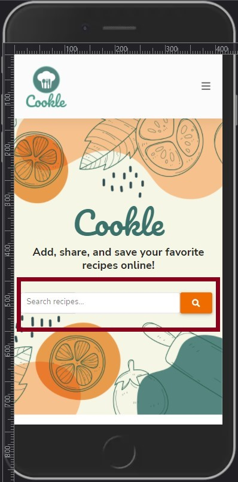
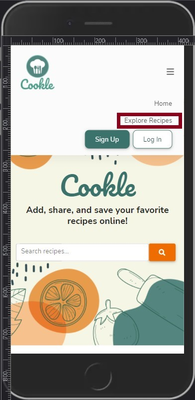
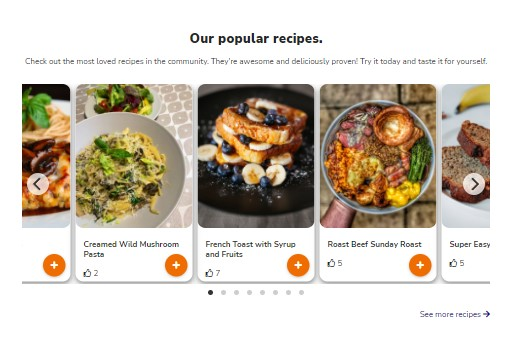
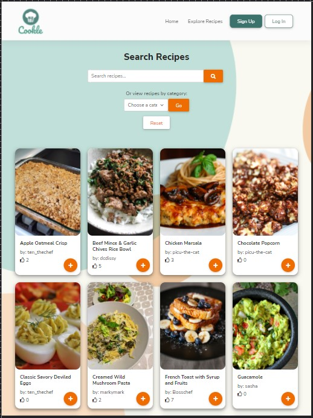
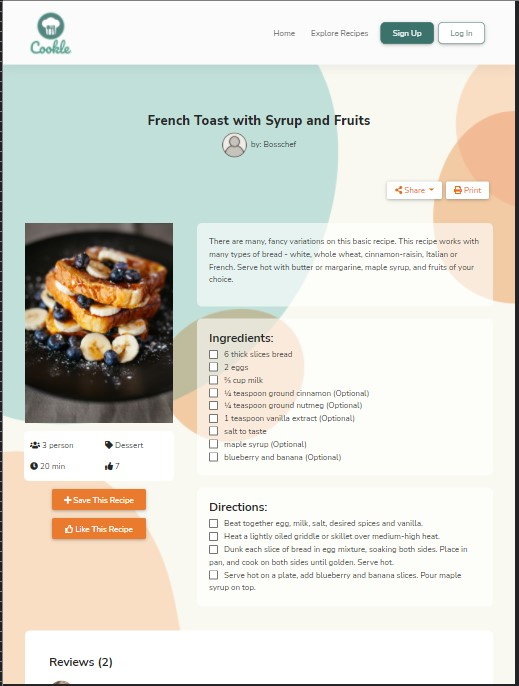
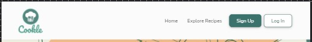
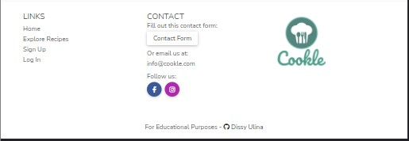
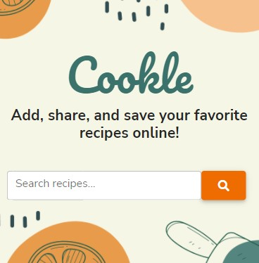
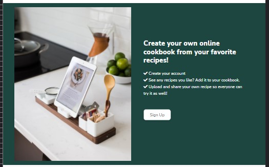

# Cookle - Testing  

[Back to the main README.md file](https://github.com/dissyulina/cookle-cookbook#cookle)  

[Back to the Testing section in main README.md file](https://github.com/dissyulina/cookle-cookbook#4-testing)  

[View live website here](https://cookle-cookbook.herokuapp.com/)   

   

**Table of Contents** 
1. [User Stories Testing]()  
2. [Manual Testing]()  
   a. [Responsiveness Testing]()  
   b. [Links Testing]()  
   c. [Game Play Testing]()   
   d. [Form Testing]()  
3. [Autoprefixer CSS]()  
4. [W3C Validator Testing]()  
5. [JSHint Testing]()   
6. [Lighthouse Testing]()  
7. [CI Peer Code Review on Slack]()
8. [Further Testing]()  

   

## **1. User Stories Testing**  
### **Unregistered User Goals**   
As a new/ unregistered user, I want to:
1. Be able to search a recipe easily
   * On the landing page in the middle of the screen, users can immediately see a search recipes input box where they can type a keyword to search the recipe.  
   * On the top right of the screen, a navigation link named "Explore Recipes" provides another way to search the recipes by navigating first to that page.  
   
      

2. See the popular recipes of the site  
   * On the Home Page (index.html), below the hero-image, users can find eight most popular recipes in the site. These are the recipes that have the most number of likes. 
   * The recipes are organized in a carousel of recipe cards, with an autoslide feature. The user can also flick the cards on touch screen devices, or click the right arrow (next) or left arrow (previous) to navigate between cards.
      

3. Explore all recipes that listed in the site  
   * Right below the popular recipes carousel, there's a link to "See more recipes". This link will direct the user to the Explore Recipes page (recipes.html).  
   * On the navigation bar, the user can navigate to the Explore Recipes page by clicking the Explore Recipes navigation link.  
   * Below are the screenshot of the Explore Recipes page on tablet device.  
     

4. Be able to view a full recipe that I'm interested in   
   * By clicking a recipe card, the user can view the full recipe even if they aren't registered/ logged-in yet.  
   * Below are the screenshot of the Individual Recipe page (single-recipe.html).  
     

5. Navigate intuitively and can spot the Sign Up button right away  
   * For unregistered users, the links on Navbar that are available to navigate are: Homepage, Explore Recipes page, Sign Up, and Log In.
   * On the landing page, the users can see the Sign Up and Log In button right away, located on the top right of the screen.  
     
   * The Navbar are dissapering on scroll down, but will be re-appearing again on a bit of scroll up. This way the users have easy access to the Navbar, and at the same time it also save spaces, allowing the content to have a full screen display. 
   * The footer, which is available at the very bottom of every page, also provides same the navigation links as Navbar.  
     

6. Understand what the site is about and how it works  
   * On the Home page, inside the hero-image, a title and tagline for the website is placed to give a user an introduction to the website in a very short statement.  
     
   * If the user decided to scroll down to investigate more and read further about the website, the user will find a little section that explains how it works, which ends with the invitation to sign up.  
     

