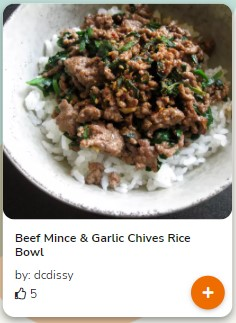

# Cookle - Testing  

[Back to the main README.md file](https://github.com/dissyulina/cookle-cookbook#cookle)  

[Back to the Testing section in main README.md file](https://github.com/dissyulina/cookle-cookbook#4-testing)  

[View live website here](https://cookle-cookbook.herokuapp.com/)   

   

**Table of Contents** 
1. [User Stories Testing]()  
2. [Manual Testing]()  
   a. [Responsiveness Testing]()  
   b. [Links Testing]()  
   c. [Game Play Testing]()   
   d. [Form Testing]()  
3. [Autoprefixer CSS]()  
4. [W3C Validator Testing]()  
5. [JSHint Testing]()   
6. [Lighthouse Testing]()  
7. [CI Peer Code Review on Slack]()
8. [Further Testing]()  

   

## **1. User Stories Testing**  
### **Unregistered User Goals**   
As a new/ unregistered user, I want to:
1. Be able to search a recipe easily
   * On the landing page in the middle of the screen, users can immediately see a search recipes input box where they can type a keyword to search the recipe.  
   * On the top right of the screen, a navigation link named "Explore Recipes" provides another way to search the recipes by navigating first to that page.  
   
      

2. See the popular recipes of the site  
   * On the Home Page (index.html), below the hero-image, users can find eight most popular recipes in the site. These are the recipes that have the most number of likes. 
   * The recipes are organized in a carousel of recipe cards, with an autoslide feature. The user can also flick the cards on touch screen devices, or click the right arrow (next) or left arrow (previous) to navigate between cards.
      

3. Explore all recipes that listed in the site  
   * Right below the popular recipes carousel, there's a link to "See more recipes". This link will direct the user to the Explore Recipes page (recipes.html).  
   * On the navigation bar, the user can navigate to the Explore Recipes page by clicking the Explore Recipes navigation link.  
   * Below are the screenshot of the Explore Recipes page on tablet device.  
     

4. Be able to view a full recipe that I'm interested in   
   * By clicking a recipe card, the user can view the full recipe even if they aren't registered/ logged-in yet.  
   * Below are the screenshot of the Individual Recipe page (single-recipe.html).  
     

5. Navigate intuitively and can spot the Sign Up button right away  
   * For unregistered users, the links on Navbar that are available to navigate are: Homepage, Explore Recipes page, Sign Up, and Log In.
   * On the landing page, the users can see the Sign Up and Log In button right away, located on the top right of the screen.  
     
   * The Navbar are dissapering on scroll down, but will be re-appearing again on a bit of scroll up. This way the users have easy access to the Navbar, and at the same time it also save spaces, allowing the content to have a full screen display. 
   * The footer, which is available at the very bottom of every page, also provides same the navigation links as Navbar.  
     

6. Understand what the site is about and how it works  
   * On the Home page, inside the hero-image, a title and tagline for the website is placed to give a user an introduction to the website in a very short statement.  
     
   * If the user decided to scroll down to investigate more and read further about the website, the user will find a little section that explains how it works, which ends with the invitation to sign up.  
     

### **Registered User Goals**   
As a returning/ registered user, I want to:  
1. Immediately be able to spot the Log In button  
   * The Log In button is can be seen right away at the top right of the page.  
     

2. See the newest added recipes on the site  
   * On the Home Page, below the popular recipes carousel, users can find eight newest added recipes in the database.  
   * The recipes are organized in a carousel of recipe cards, with an autoslide feature. The user can also flick the cards on touch screen devices, or click the right arrow (next) or left arrow (previous) to navigate between cards.  
     

3. Once logged in, easily navigate  to my account settings, my cookbook, and other pages available to me.  
   * Once the user logged-in or signed-up, the links on Navbar that are available to navigate are: Homepage, Explore Recipes page, My Cookbook page, A Dropdown profile picture which has navigation items: Create Recipe, View Profile, and Log Out.  
     

4. Be able to Edit or Delete my profile
   * Once the user logged-in or signed-up, they will be directed to the Profile page. The first section of the Profile page is "My Profile", where user can see their account information. User can manage their account by clicking the "Manage Account" dropdown button on the top right corner, with options to : Edit Profile (change Username, change Email, change About Me, and change/upload a profile image), Change Password, and Delete Account.  
     
   * When the user click "Edit Profile", the user will be directed to the Edit Profile page (edit-profile.html), with buttons to Cancel and to Submit the edited profile.
     
   * The user can also delete their profile by clicking "Delete Profile" button. A modal will pop up to confirm the deletion, as a barrier in case the user accidentaly clicked the button. The modal comes with buttons to Cancel and to Delete the profile.  
     

5. Be able to Create a recipe and share it to the site, and to Edit or Delete it afterwards as needed  
   * There are various ways users can create a recipe, to ensure easy navigation, by clicking :
     - Call to Action button on the Profile page, or  
       
     - The profile picture dropdown button on the Navbar and choose Create Recipe, or  
       
     - Call to action button on the bottom of My Cookbook page, or  
       
     - Navigation link to Create Recipe on the footer 
   * Once the user clicked the Create Recipe link/ button, they will be directed to the Create Recipe page (see here)
   * There are various was to Edit or Delete a recipe: 
     - After user created a recipe, the user will be directed to the newly created recipe page. On the top right of the recipe page, the user wil be able to locate an Edit button and a Delete button.  
       
     - The user can also manage all their created recipes from the Profile page by clicking the "Uploaded Recipes" collapse button, and navigate to the ellipsis button to find the option to Edit and Delete.  
       
   * Once the user clicked the Edit Recipe button, they will be directed to the Edit Recipe page (see here).  
   * Once the user clicked the Delete Recipe button, a modal will pop up to confirm the deletion, as a barrier in case the user accidentaly clicked the button. The modal comes with buttons to Cancel and to Delete the recipe.  
        

6. Be able to Save a recipe that I like to my cookbook, and to remove it from my cookbook as needed.  
   * Ways to save a recipe to user's cookbook:
     - By clicking the plus button on a recipe card. When a recipe is already saved to the cookbook, the plus button becomes disabled and displays a check icon.  
      
       
     - By clicking the "Save to cookbook" button on a recipe page. When a recipe is already saved to the cookbook, the button will displays "Saved to Cookbook" with a checked icon.  
      
        

   * Ways to remove a recipe from user's cookbook:  
     - By clicking again the Saved to Cookbook button on the Recipe page (see images from previous point). A modal to confirm the remove will show up.
     - By managing it from the Profile page, where the usec can click on the "See All My Saved Recipes" collapse button, then click the trash icon located on the right side of the recipe's name that the user wants to remove.  
       
     - A modal will pop up to confirm the remove, as a barrier in case the user accidentaly clicked the button. The modal comes with buttons to Cancel and to Remove.  
       

7. Be able to give a like to a recipe, and also unlike it as needed.  
   * To like a recipe, simply click the "Like this recipe" button on the Recipe page. The button will then turn to "Liked", and the number of likes will increase by one. To unlike a recipe, clicked the "Liked" button again, and it will turn back to "Like this recipe", and the number of likes will decrease by one as well.  
    
      

8. Be able to write a review on a recipe page, and to edit or delete my review  
   * To write a review, click the "Write A Review" button on a Recipe page. A text-area form will show up with a Cancel and Submit Review buttons.  
     
   * To edit a review, click on the elipsis button on the right side of the review that the user wants to edit. It will show the options to edit or to delete review. After choosing the Edit button, a text-area with the review text inside will show up.  
     
      
   * To delete a review, click again on the elipsis button on the right side of the review that the user wants to delete, and choose the delete option. A modal confirmation will pop up.  
     

9. Be able to share a recipe on social media easily  
   * A dropdown share button is located on the top right of the Recipe page. When clicked, it provides the options to share the recipe page to: Whatsapp, Facebook, Twitter, and Pinterest.  
      

10. Be able to print a recipe easily
   * A print button is located on the top right of the Recipe page. When clicked, it connects right away to the print feature of the users' computer.  
     
   
11. Find a contact page for my inquiries  
   * To contact the admin or site owners, users can navigate to the footer and click on the "Contact Form" button. Another option to contact would be to send an email or to find the social media page. When the contact form button is clicked, a contact form modal will show up.  
     

### **Administrative Account**   
As an Administrative Account holder, I want to:
1. Be able to do all the functionalities as a registered user can
   * All functionalities as a general user are available for the admin.  

2. Add, Edit, or Delete a category of recipes  
   * Once the Admin logged-in, a "Manage Categories" navigation link can be found inside the profile picture dropdown button. This navigation link will direct the Admin to the Manage Categories page (categories.html).    
      
   * Inside the Manage Categories page, Admin can add a new category, and edit or delete a category.  
      
   * A modal will show up when the Delete button is clicked, confirming the deletion.  
      

3. Be able to edit any recipes listed on the site as needed.  
   * The Edit Recipe button on each of the recipe page is available for admin to access, even though the recipe was created by another user. This functionality is added for Admin in order to keep the database clean.
  
4. Be able to delete any recipes listed on the site as needed.  
   * The Delete Recipe button on each of the recipe page is available for admin to access, even though the recipe was created by another user. This functionality is added for Admin in order to keep the database clean.  

5. Be able to delete offensive reviews on the site as needed.  
   * The Delete review button inside the ellipsis dropdown button is available for admin to access. Admin can only delete a review, not edit it.  

